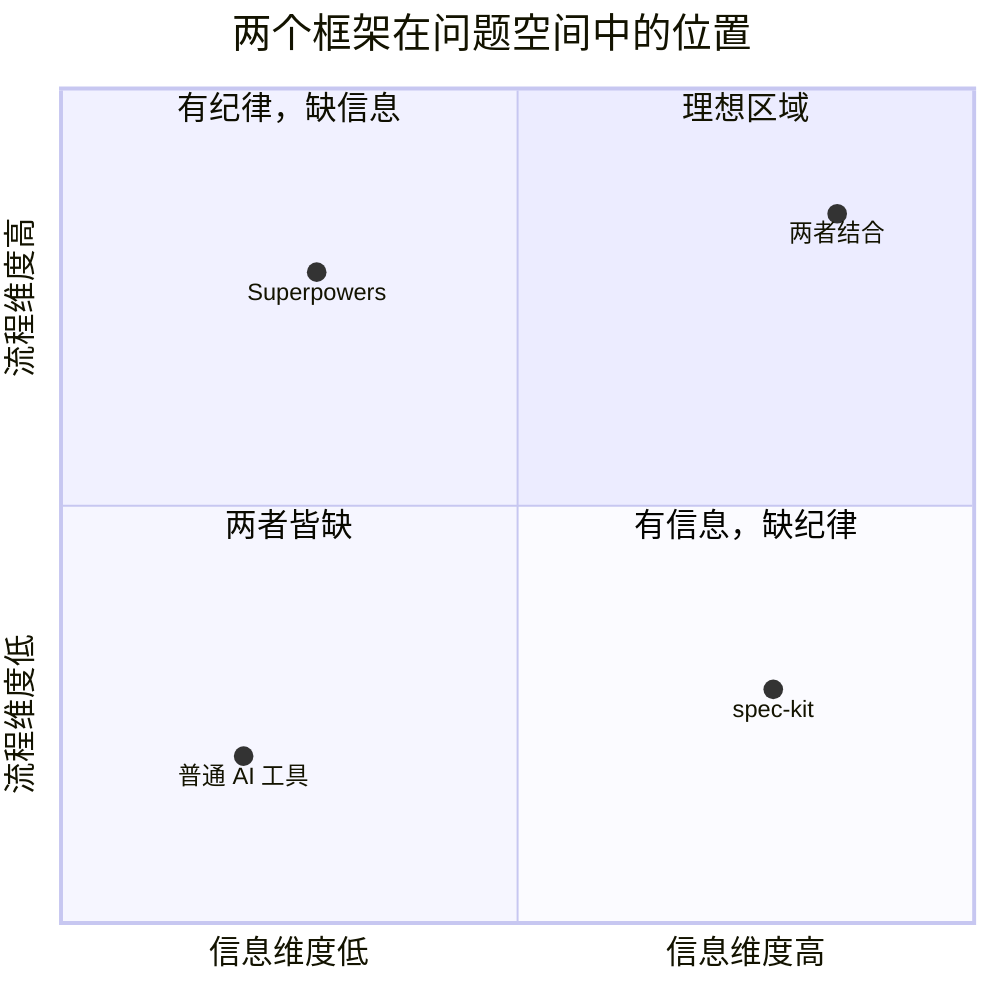
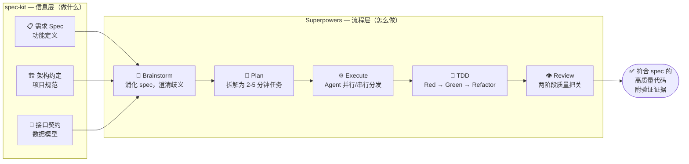
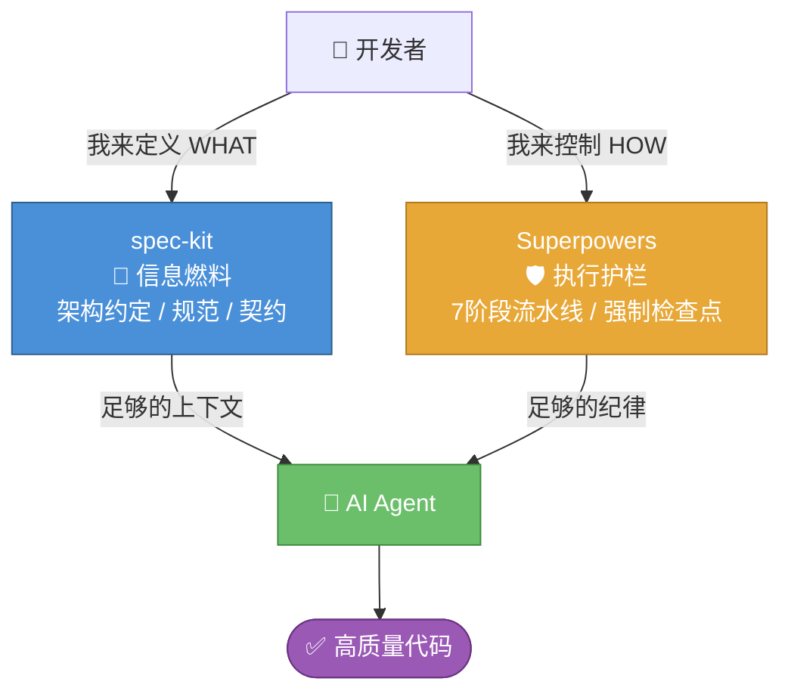

# Superpowers × spec-kit — 框架对比与互补关系

> 两个框架解决的是同一问题的不同维度，组合使用才是最优解。

---

## 核心洞察

```
Superpowers 问的是：AI 执行时会不会失控？   → 流程/纪律问题
spec-kit     问的是：AI 知不知道该做什么？   → 信息/上下文问题
```

---

## 图1：问题维度定位



---

## 图2：互补工作流



---

## 图3：职责分工



---

## 理念对比

| 维度 | spec-kit | Superpowers |
|------|----------|-------------|
| **核心问题** | AI 不知道做什么（信息不足） | AI 执行会失控（缺乏纪律） |
| **解法** | 写精确的规格文档作为输入 | 7阶段流水线 + 强制门禁 |
| **比喻** | 给 AI 一份完整的建筑蓝图 | 给 AI 装上优秀工程师的习惯 |
| **信任模型** | 信任 AI 能力，只要信息到位 | 不信任 AI 自律性，靠结构约束 |
| **人的角色** | 前期写好 spec，后期验收 | 全程多个强制审批点 |
| **学习成本** | 低（会写文档就会用） | 高（14 个技能，7 个阶段） |
| **平台依赖** | 几乎任何 AI 工具 | 需支持 Skills/工具调用的平台 |

---

## 使用场景建议

```
只用 spec-kit：
  ✓ 需求清晰，快速原型
  ✓ 团队有强约定，想让 AI 遵守
  ✗ 对执行质量/测试没有高要求时

只用 Superpowers：
  ✓ 需求复杂，需要 AI 帮你澄清
  ✓ 重视 TDD、Code Review 流程
  ✗ 没有清晰的项目规范注入

两者结合（最优）：
  → spec-kit 产出的 Spec 文档
    作为 Superpowers Brainstorm 阶段的输入
  → Superpowers 的 Plan 文档
    引用 spec-kit 的架构约定
  → 实现既符合规范，又经过质量把关
```

---

## 一句话总结

> **spec-kit 解决"AI 不知道做什么"，Superpowers 解决"AI 知道但会乱做"——两者组合，才是完整的 AI 开发质量保障。**

---

## 相关笔记

- [[00-总览与分享大纲]]
- [[01-设计哲学]]
- [[02-七阶段开发工作流]]
